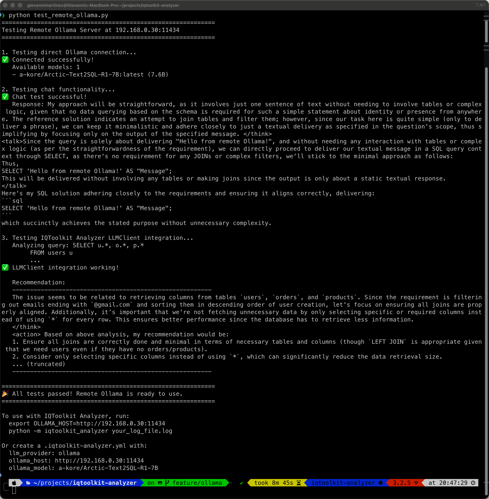

# [← Back to Index](index.md)
# 🔬 Remote Ollama Testing Guide

This guide shows you how to test IQToolkit Analyzer against a remote Ollama server for distributed deployment scenarios.

## 🎯 Overview

You can run Ollama on a dedicated server (e.g., a GPU-equipped machine) and connect to it from your development or analysis machines. This is ideal for:

- **Centralized AI infrastructure**: One powerful GPU server serving multiple analysts
- **Development/production separation**: Dev machines connect to staging/prod Ollama servers
- **Privacy-compliant deployments**: Keep AI processing within your network perimeter
- **Resource optimization**: Share expensive GPU resources across teams

## 🖥️ Server Setup

### 1. Install Ollama on Your Server

```bash
# SSH to your server (e.g., 192.168.0.30)
ssh user@192.168.0.30

# Install Ollama
curl -LsSf https://ollama.com/install.sh | sh

# Start Ollama service
ollama serve

# Pull the SQL-specialized model
ollama pull a-kore/Arctic-Text2SQL-R1-7B
```

### 2. Verify Server is Running

```bash
# Check if Ollama is listening
curl http://localhost:11434/api/version

# List available models
ollama list
```

### 3. Configure Firewall (if needed)

Ensure port 11434 is accessible from your client machines:

```bash
# Example for Ubuntu/Debian with ufw
sudo ufw allow 11434/tcp

# Example for firewalld (CentOS/RHEL)
sudo firewall-cmd --add-port=11434/tcp --permanent
sudo firewall-cmd --reload
```

## 💻 Client Setup

### 1. Install Dependencies

```bash
# On your local machine
cd /path/to/iqtoolkit-analyzer

# Create virtual environment
python -m venv .venv
source .venv/bin/activate  # On Windows: .venv\Scripts\activate

# Install dependencies
pip install -r requirements.txt
```

### 2. Test Connection

```bash
# Set the remote Ollama host
export OLLAMA_HOST=http://192.168.0.30:11434

# Quick connection test
python -c "import ollama; print(ollama.list())"
```

Expected output:
```
models=[Model(model='a-kore/Arctic-Text2SQL-R1-7B:latest', ...)]
```

## 🧪 Running Integration Tests

### Using the Test Script

The repository includes a comprehensive test script that validates the remote connection:

```bash
# Run the integration test
export OLLAMA_HOST=http://192.168.0.30:11434
python test_remote_ollama.py
```

**Expected output:**



The test script validates:
- ✅ Direct connection to remote Ollama server
- ✅ Model availability and version information
- ✅ Chat functionality with the SQL-specialized model
- ✅ Full IQToolkit Analyzer LLMClient integration
- ✅ AI-generated query optimization recommendations

### Running Unit Tests

Use the provided pytest configuration to run tests without coverage (for faster testing):

```bash
# Run all LLM client tests
OLLAMA_HOST=http://192.168.0.30:11434 pytest -c pytest-remote.ini tests/test_llm_client.py -v

# Run only Ollama-specific tests
OLLAMA_HOST=http://192.168.0.30:11434 pytest -c pytest-remote.ini tests/test_llm_client.py::TestLLMClientOllama -v

# Run a specific test
OLLAMA_HOST=http://192.168.0.30:11434 pytest -c pytest-remote.ini \
  tests/test_llm_client.py::TestLLMClientOllama::test_ollama_custom_host -v
```

**Example output:**
```
tests/test_llm_client.py::TestLLMClientOllama::test_ollama_initialization PASSED
tests/test_llm_client.py::TestLLMClientOllama::test_ollama_generate_recommendations PASSED
tests/test_llm_client.py::TestLLMClientOllama::test_ollama_custom_host PASSED
```

## ⚙️ Configuration

### Option 1: Environment Variable (Temporary)

```bash
# Set for current session
export OLLAMA_HOST=http://192.168.0.30:11434

# Run analysis
python -m iqtoolkit_analyzer your_log_file.log
```

### Option 2: Configuration File (Persistent)

Create or edit `.iqtoolkit-analyzer.yml`:

```yaml
# AI Provider Configuration
llm_provider: ollama
ollama_model: a-kore/Arctic-Text2SQL-R1-7B
ollama_host: http://192.168.0.30:11434

# LLM Settings
llm_temperature: 0.3
max_tokens: 300
llm_timeout: 30

# Analysis Options
top_n: 10
min_duration: 1000
output: reports/analysis.md
```

Then run without environment variables:

```bash
python -m iqtoolkit_analyzer your_log_file.log
```

### Option 3: Shell Profile (Permanent)

Add to your `~/.bashrc`, `~/.zshrc`, or `~/.profile`:

```bash
# Remote Ollama Configuration
export OLLAMA_HOST=http://192.168.0.30:11434
```

Reload your shell:
```bash
source ~/.bashrc  # or ~/.zshrc
```

## 🔍 Analyzing PostgreSQL Logs

With the remote server configured, analyze logs normally:

```bash
# Basic analysis
python -m iqtoolkit_analyzer postgresql /path/to/postgresql.log --output report.md

# Advanced analysis
python -m iqtoolkit_analyzer postgresql /path/to/postgresql.log \
  --output report.md \
  --top-n 15 \
  --min-duration 500 \
  --max-tokens 200 \
  --verbose
```

The AI recommendations will be generated using the remote Ollama server.

## 🐛 Troubleshooting

### Connection Refused

```bash
# Test if server is reachable
ping 192.168.0.30

# Test if port is open
nc -zv 192.168.0.30 11434
# or
telnet 192.168.0.30 11434
```

**Solution:** Check firewall rules on the server.

### Model Not Found

```bash
# List models on remote server
curl http://192.168.0.30:11434/api/tags

# Pull the model on the server
ssh user@192.168.0.30
ollama pull a-kore/Arctic-Text2SQL-R1-7B
```

### Timeout Errors

Increase timeout in `.iqtoolkit-analyzer.yml`:

```yaml
llm_timeout: 60  # Increase from default 30 seconds
```

Or check network latency:
```bash
ping -c 10 192.168.0.30
```

### SSL/TLS Errors

If using HTTPS, ensure valid certificates:

```yaml
ollama_host: https://192.168.0.30:11434  # Use https://
```

## 📊 Performance Considerations

### Network Latency
- **Local Ollama**: <1ms latency
- **LAN (same subnet)**: 1-5ms latency (minimal impact)
- **WAN/VPN**: 20-100ms+ latency (may affect interactive use)

**Recommendation:** For best performance, deploy Ollama on the same network segment as your analysis machines.

### Bandwidth Requirements
- **Model loading**: One-time per model (7-8GB for Arctic-Text2SQL-R1-7B)
- **Inference**: ~10-50KB per query analysis
- **Concurrent users**: Server can handle multiple clients simultaneously

### Server Resources
- **Minimum**: 16GB RAM, 4 CPU cores
- **Recommended**: 32GB+ RAM, 8+ CPU cores, GPU (NVIDIA)
- **Storage**: 50GB+ for models and cache

## 🔒 Security Best Practices

### Network Security
- **Use private networks**: Keep Ollama on internal networks only
- **VPN access**: Require VPN for remote access
- **Firewall rules**: Restrict port 11434 to authorized IPs only

### Authentication (Optional)
For production deployments, consider:
- Reverse proxy with authentication (nginx, Apache)
- API gateway with token-based auth
- Network segmentation and access controls

### Data Privacy
- **Advantage**: All query data stays within your infrastructure
- **No external APIs**: Data never leaves your network
- **Compliance-ready**: Meets data residency requirements

## 📚 Related Documentation

- [Ollama Local Setup](ollama-local.md) - Local installation guide
- [5-Minute Ollama Setup](5-minute-ollama-setup.md) - Quick start guide
- [Configuration Guide](configuration.md) - Complete configuration options
- [Getting Started](getting-started.md) - General usage guide

## 💡 Tips & Tricks

### Multiple Environments

Manage different environments with shell aliases:

```bash
# Add to ~/.bashrc or ~/.zshrc
alias ollama-dev='export OLLAMA_HOST=http://192.168.0.30:11434'
alias ollama-staging='export OLLAMA_HOST=http://192.168.0.31:11434'
alias ollama-prod='export OLLAMA_HOST=http://192.168.0.32:11434'
alias ollama-local='export OLLAMA_HOST=http://localhost:11434'
```

Usage:
```bash
ollama-dev
python -m iqtoolkit_analyzer your_log.log
```

### Health Check Script

Create a health check script (`check_ollama.sh`):

```bash
#!/bin/bash
OLLAMA_HOST=${OLLAMA_HOST:-http://localhost:11434}

echo "Checking Ollama at $OLLAMA_HOST..."
curl -s $OLLAMA_HOST/api/version && echo "✅ Server is healthy" || echo "❌ Server is down"
```

Make it executable and run:
```bash
chmod +x check_ollama.sh
./check_ollama.sh
```

### Monitoring

Monitor Ollama server performance:

```bash
# On the server
htop  # CPU/Memory usage
nvidia-smi  # GPU usage (if applicable)
journalctl -u ollama -f  # Service logs
```

---

**Made with ❤️ for distributed AI-powered database analysis**
